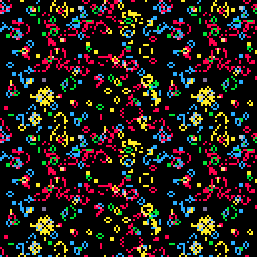

Pico Garden
===========

Pico Garden is slow-play, low-interaction, screen-saver game for the [PICO-8][] fantasy console.
It is a game for dreamers, grinders, slackers and thinkers.

Four layers evolve independently using Conway's Game of Life cellular automata rules.

Next to that, there is a background reaper process for each layer.
It randomly removes cells that have been static for too long.
So if you do not do anything, your garden will eventually die out.

If you wish, you can every so often initiate a revive action, which will scan the entire grid.
Anywhere where there are alive cells in two neighbouring layers, new cells are sprouted in the other two layers.
Often these new cells die immediately of starvation, but sometimes they initiate a flurry of activity.

You can use the up and down keys to speed-up and slow-down time.
You can use the left and right keys to change the view.
There's even a fancy plot that shows how well your garden is doing.

The music adapts dynamically to the garden.
The building blocks are sixteen different one-channel sound tracks that can be freely mixed to create 624 unique 4-channel patterns.

Credits
-------
The adaptive music has been composed by my brother Paul. Thanks again!

In order to maximise performance, the Game of Life rules are implemented by performing bitwise operations.
This is heavily inspired by [rilden's Game of Life](https://www.lexaloffle.com/bbs/?pid=94115).

The game also uses [Felice's 32-bit integer to string conversion code](https://www.lexaloffle.com/bbs/?pid=22809).

[PICO-8]: https://www.lexaloffle.com/pico-8.php
